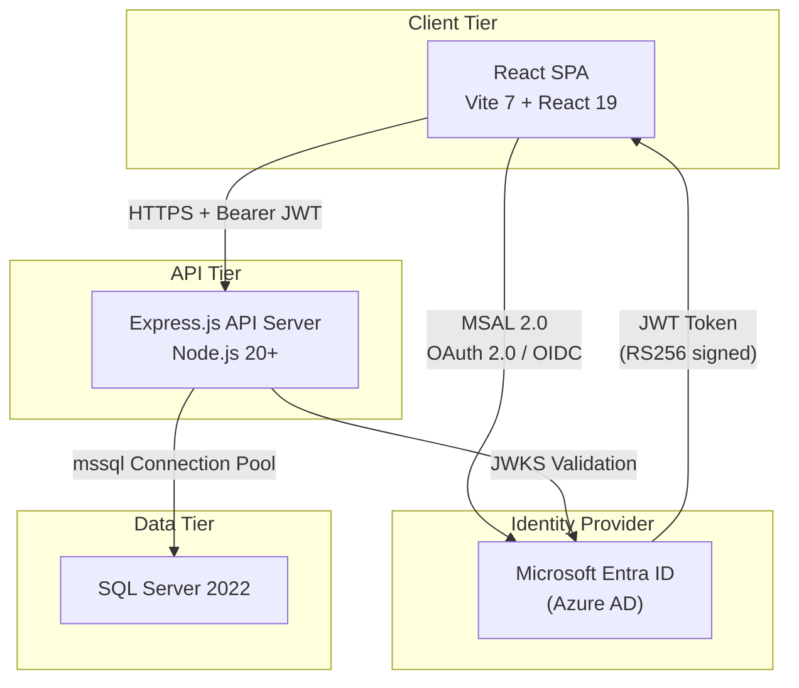
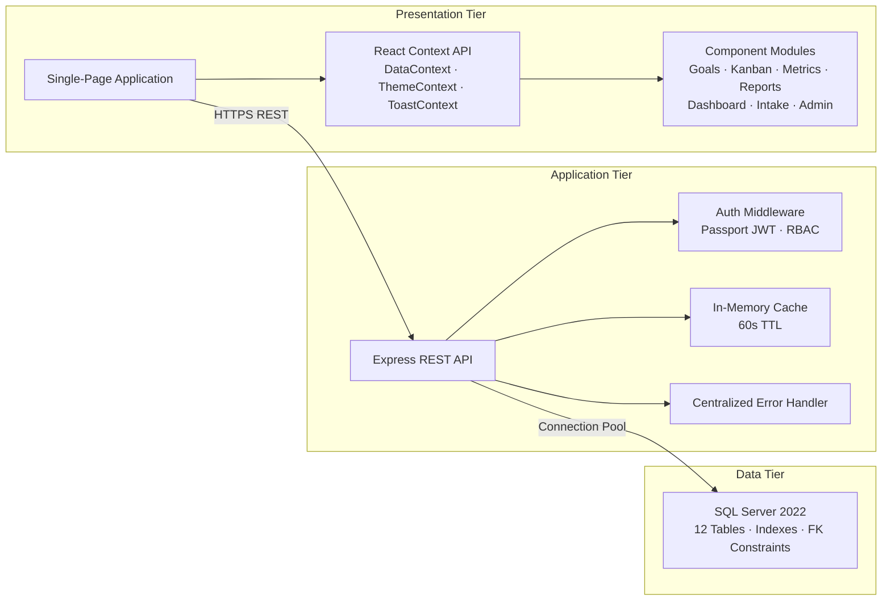
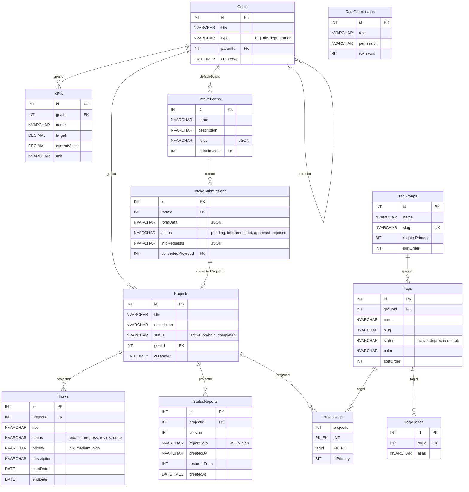
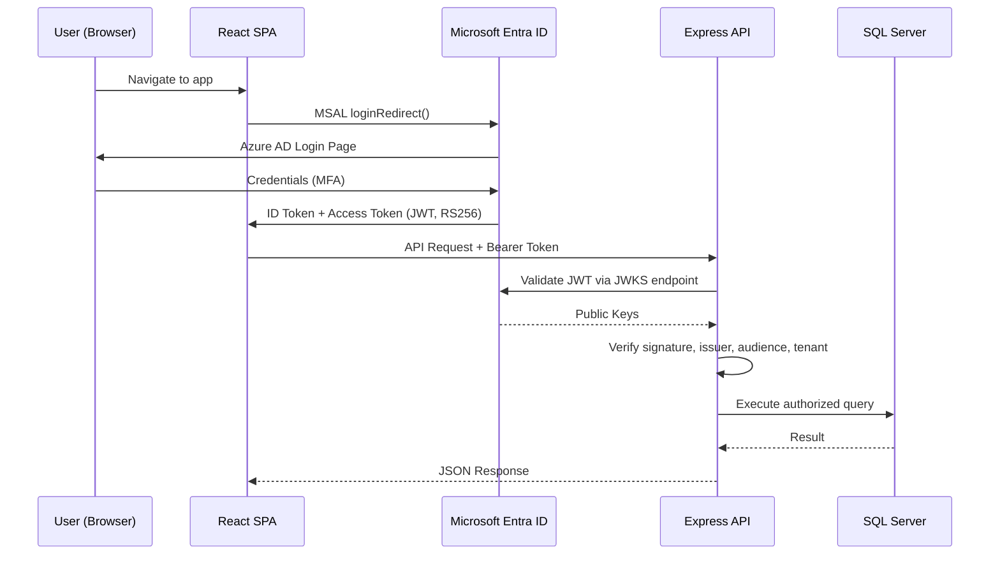
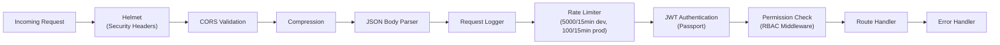
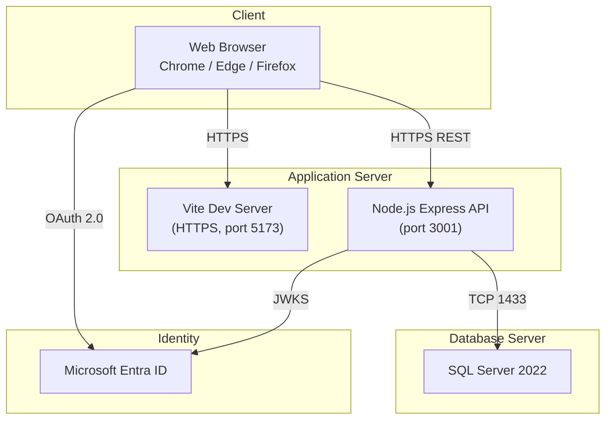

# Digital Health Atlas — Architecture Review Board Document

**Document Version:** 1.0  
**Date:** February 10, 2026  
**Author:** Digital Health IT Portfolio Management  
**Classification:** Internal — Architecture Review Board  

---

## Table of Contents

1. [Executive Summary](#1-executive-summary)
2. [Business Context & Objectives](#2-business-context--objectives)
3. [System Overview](#3-system-overview)
4. [Architecture Design](#4-architecture-design)
5. [Data Architecture](#5-data-architecture)
6. [Security Architecture](#6-security-architecture)
7. [API Design](#7-api-design)
8. [Frontend Architecture](#8-frontend-architecture)
9. [Deployment Architecture](#9-deployment-architecture)
10. [Performance & Scalability](#10-performance--scalability)
11. [Compliance & Standards](#11-compliance--standards)
12. [Risk Assessment](#12-risk-assessment)
13. [Future Roadmap](#13-future-roadmap)
14. [Appendix](#14-appendix)

---

## 1. Executive Summary

The **Digital Health Atlas** (DHA) is a web-based IT portfolio management platform purpose-built for healthcare organizations. It provides a single, real-time view of strategic goals, project portfolios, task boards, KPI metrics, status reporting, and project intake — enabling leadership to track progress, priorities, dependencies, risks, and measurable outcomes across the digital health landscape.

### Key Capabilities

| Capability | Description |
|---|---|
| **Strategic Goal Hierarchy** | Multi-tiered goal tree (Organization → Division → Department → Branch) with cascading progress rollup |
| **Project Portfolio Management** | Full project lifecycle with Kanban, Table, Gantt, and Calendar views |
| **KPI / Metrics Dashboard** | Quantitative indicators linked to goals with target vs. actual tracking |
| **Executive Summary Dashboard** | Filterable, exportable PDF overview of portfolio status for leadership |
| **Status Reporting** | Versioned status reports with executive summaries, RAG ratings, and milestone tracking |
| **Project Intake & Workflow** | Configurable intake forms with approval/rejection/info-request workflow |
| **Multi-Dimensional Tagging** | Faceted taxonomy (7 tag groups, 30+ tags) for slicing portfolio by domain, capability, risk, geography, etc. |
| **Role-Based Access Control** | Azure AD-integrated RBAC with 6 app roles and granular DB-backed permissions |

---

## 2. Business Context & Objectives

### Problem Statement

Healthcare IT organizations manage complex portfolios spanning clinical systems, infrastructure, compliance, and digital innovation. Without a unified platform, visibility into cross-cutting priorities, progress, and risk is fragmented across spreadsheets, emails, and departmental silos.

### Strategic Objectives

- **Unified Visibility:** Single source of truth for all digital health initiatives
- **Strategic Alignment:** Link every project to measurable organizational goals and KPIs
- **Executive Decision Support:** Real-time dashboards and exportable reports for leadership
- **Accountability:** Versioned status reports with RAG ratings and audit trails
- **Intake Governance:** Structured request-to-project pipeline with approval workflows
- **Taxonomy & Analysis:** Multi-dimensional tagging for portfolio analysis across domains, capabilities, outcomes, and geographies

---

## 3. System Overview

### High-Level Architecture



### Technology Stack

| Layer | Technology | Version | Purpose |
|---|---|---|---|
| **Frontend Framework** | React | 19.2 | Component-based UI |
| **Build Tooling** | Vite | 7.2 | Dev server, HMR, production bundling |
| **Authentication (Client)** | @azure/msal-browser + msal-react | 5.x | OAuth 2.0 / OIDC token acquisition |
| **Icons** | Lucide React | 0.563 | Consistent iconography |
| **PDF Export** | html2pdf.js | 0.14 | Client-side PDF generation |
| **API Server** | Express.js | 4.18 | RESTful API |
| **Runtime** | Node.js | 20+ | Server runtime |
| **Authentication (Server)** | passport-jwt + jwks-rsa | 4.x / 3.x | JWT validation via JWKS endpoint |
| **Database Driver** | mssql | 10.x | SQL Server connectivity |
| **Security Middleware** | Helmet | 8.x | HTTP security headers |
| **Rate Limiting** | express-rate-limit | 8.x | Request throttling |
| **Compression** | compression | 1.x | gzip response compression |
| **Caching** | node-cache | 5.x | In-memory TTL cache |
| **Database** | Microsoft SQL Server | 2022 | Relational data store |

---

## 4. Architecture Design

### Architecture Pattern

The system follows a **classic three-tier architecture** with clear separation of concerns:



### Design Principles

| Principle | Implementation |
|---|---|
| **Separation of Concerns** | Frontend (React) ↔ API (Express) ↔ Data (SQL Server) with clear boundaries |
| **Defense in Depth** | Authentication → Rate Limiting → Authorization → Input Validation → Parameterized Queries |
| **Fail Closed** | Permission checks default to deny; errors during auth return 403/500 |
| **Least Privilege** | 6 distinct app roles with granular, DB-configurable permissions |
| **Convention over Configuration** | Consistent API patterns (`GET`, `POST`, `PUT`, `DELETE`) per resource domain |
| **Progressive Enhancement** | Lazy loading of project details; cached aggregations for dashboards |

---

## 5. Data Architecture

### Entity-Relationship Diagram



### Table Summary

| Table | Records (Expected) | Purpose |
|---|---|---|
| `Goals` | 50 – 200 | Hierarchical strategic goals (org → div → dept → branch) |
| `KPIs` | 100 – 500 | Key Performance Indicators linked to goals |
| `Projects` | 50 – 300 | Tracked initiatives with status and goal alignment |
| `Tasks` | 500 – 5,000 | Actionable work items with kanban-style workflow |
| `StatusReports` | 200 – 2,000 | Versioned JSON status reports with audit trail |
| `TagGroups` | 7 (seed) | Taxonomy facets (Domain, Capability, Work Type, etc.) |
| `Tags` | 30+ (seed) | Taxonomy values with color coding and lifecycle status |
| `ProjectTags` | 100 – 2,000 | Many-to-many project ↔ tag assignments |
| `TagAliases` | 50+ | Synonym support for tag search |
| `IntakeForms` | 5 – 20 | Configurable intake form definitions |
| `IntakeSubmissions` | 50 – 500 | Submitted intake requests with workflow status |
| `RolePermissions` | 50 – 100 | Dynamic RBAC permission assignments |

### Indexing Strategy

```sql
-- Foreign key and query-optimized indexes
IX_Goals_ParentId       ON Goals(parentId)
IX_KPIs_GoalId          ON KPIs(goalId)
IX_Projects_GoalId      ON Projects(goalId)
IX_Tasks_ProjectId      ON Tasks(projectId)
IX_Tasks_Status         ON Tasks(status)
IX_StatusReports_ProjectId ON StatusReports(projectId)
IX_IntakeSubmissions_FormId ON IntakeSubmissions(formId)
IX_IntakeSubmissions_Status ON IntakeSubmissions(status)
IX_Tags_GroupId         ON Tags(groupId)
IX_Tags_Status          ON Tags(status)
IX_ProjectTags_TagId    ON ProjectTags(tagId)
IX_TagAliases_TagId     ON TagAliases(tagId)
```

---

## 6. Security Architecture

### Authentication Flow



### Authentication Details

| Aspect | Implementation |
|---|---|
| **Protocol** | OAuth 2.0 / OpenID Connect |
| **Identity Provider** | Microsoft Entra ID (Azure AD) |
| **Token Type** | JWT (RS256 signed) |
| **Token Validation** | JWKS-based key rotation via `jwks-rsa` library |
| **Tenant Lock** | Application is locked to a specific Azure AD tenant (not `common`) |
| **Audience Validation** | Accepts both `clientId` and `api://<clientId>` |
| **Issuer Validation** | v1.0 and v2.0 Azure AD issuers accepted |
| **Client Library** | `@azure/msal-browser` v5 with redirect flow |
| **Rate Limiting on Auth** | Applied before authentication to prevent brute-force attacks |

### Authorization Model

#### Azure AD App Roles

| Role | Value | Description |
|---|---|---|
| Administrator | `Admin` | Full access to all features, bypasses permission checks |
| Editor | `Editor` | Create/edit projects, tasks, goals, reports |
| Viewer | `Viewer` | Read-only access to dashboards and reports |
| Intake Manager | `IntakeManager` | Manage intake form submissions (approve/reject/request info) |
| Executive View | `ExecView` | Access to executive summary dashboard |
| Intake Submitter | `IntakeSubmit` | Submit new intake requests |

#### Granular Permission System

Beyond app roles, the system uses a **database-driven permission matrix** (`RolePermissions` table) for fine-grained control:

| Permission Key | Scope |
|---|---|
| `can_create_goal` | Create strategic goals |
| `can_edit_goal` | Modify existing goals |
| `can_delete_goal` | Remove goals |
| `can_view_projects` | View project portfolio |
| `can_create_project` | Create new projects |
| `can_edit_project` | Modify project details |
| `can_delete_project` | Remove projects |
| `can_manage_kpis` | Create/edit/delete KPIs |
| `can_manage_tags` | Administer taxonomy (Admin only) |
| `can_manage_intake_forms` | Create/modify intake forms |
| `can_view_exec_dashboard` | Access executive summary |

**Security Properties:**

- **Admin Bypass:** Users with the `Admin` role automatically pass all permission checks
- **Fail Closed:** If permission check encounters an error, access is denied (HTTP 500)
- **Cache-Accelerated:** Permissions are cached in-memory for 60 seconds to reduce DB load
- **Cache Invalidation:** Cache is explicitly invalidated when permissions are updated via the Admin panel

### HTTP Security Headers (Helmet)

| Header/Policy | Configuration |
|---|---|
| `Content-Security-Policy` | Restricts script/connect/style/font sources to trusted domains |
| `X-Content-Type-Options` | `nosniff` |
| `X-Frame-Options` | `DENY` |
| `Strict-Transport-Security` | Enabled (HSTS) |
| `Cross-Origin-Resource-Policy` | `cross-origin` |
| `X-XSS-Protection` | Enabled |

### SQL Injection Prevention

All database queries use **parameterized queries** via the `mssql` library's `request.input()` API. No string concatenation of user input into SQL.

```javascript
// Example: Parameterized query pattern
const pool = await getPool();
await pool.request()
    .input('id', sql.Int, parseInt(req.params.id))
    .input('title', sql.NVarChar, req.body.title)
    .query('UPDATE Projects SET title = @title WHERE id = @id');
```

---

## 7. API Design

### API Resource Domains

The REST API is organized into 8 resource domains with consistent CRUD patterns:

| Domain | Base Path | Endpoints | Auth Required |
|---|---|---|---|
| **Goals** | `/api/goals` | GET, POST, PUT, DELETE | ✅ (Permission-based) |
| **KPIs** | `/api/kpis` | POST, PUT, DELETE | ✅ (`can_manage_kpis`) |
| **Tags** | `/api/tags` | GET | ✅ (View permission) |
| **Tag Admin** | `/api/admin/tag-groups`, `/api/admin/tags` | CRUD | ✅ (`can_manage_tags`) |
| **Projects** | `/api/projects` | GET, POST, PUT, DELETE | ✅ (Permission-based) |
| **Tasks** | `/api/projects/:id/tasks` | POST, PUT, DELETE | ✅ (Permission-based) |
| **Status Reports** | `/api/projects/:id/reports` | GET, POST | ✅ (varies) |
| **Intake** | `/api/intake-forms`, `/api/intake-submissions` | CRUD | ✅ (Role-based) |
| **Permissions** | `/api/admin/permissions` | GET, PUT | ✅ (`Admin` role) |

### Request/Response Format

- **Content-Type:** `application/json`
- **Authentication:** `Authorization: Bearer <JWT>`
- **Error Responses:** `{ "error": "<message>" }` with appropriate HTTP status codes
- **Success Responses:** Resource object or `{ "success": true }`

### Middleware Pipeline



---

## 8. Frontend Architecture

### Component Module Structure

```
src/
├── App.jsx                    # Root: Auth gating (Authenticated/Unauthenticated templates)
├── components/
│   ├── AppContent.jsx         # Navigation, view switching, filter state management
│   ├── Auth/                  # LoginPage
│   ├── Layout/                # Sidebar navigation, theme toggle
│   ├── Dashboard/             # Executive summary with filterable status table
│   ├── Goals/                 # Hierarchical goal tree with CRUD, KPI indicators
│   ├── Kanban/                # Project grid → Kanban board → Task detail
│   │   ├── KanbanView.jsx     # Project card grid with filtering
│   │   ├── KanbanBoard.jsx    # Task board (Kanban / Table / Gantt / Calendar views)
│   │   ├── TaskTableView.jsx  # Tabular task list
│   │   ├── GanttView.jsx      # Timeline visualization
│   │   ├── CalendarView.jsx   # Calendar task view
│   │   └── TaskDetailPanel.jsx# Side-panel task editor
│   ├── Metrics/               # KPI dashboard with goal filtering
│   ├── Reports/               # Multi-project report builder with PDF export
│   ├── StatusReport/          # Per-project status report editor and viewer
│   ├── Intake/                # Intake form builder, submission list, review workflow
│   ├── Admin/                 # RBAC permission management panel
│   └── UI/                    # Shared components (Modal, CascadingGoalFilter, ProjectTagSelector, Toast)
├── context/
│   ├── DataContext.jsx        # Central data store: API integration, computed state, CRUD operations
│   ├── ThemeContext.jsx       # Dark/light theme management
│   └── ToastContext.jsx       # Notification system
└── hooks/
    └── useAuth.js             # Authentication state and role-checking utilities
```

### State Management

The application uses **React Context API** for global state (no external state library):

| Context | Responsibilities |
|---|---|
| `DataContext` | All domain data (goals, projects, tasks, tags, metrics), API calls, computed values (project completion, goal progress) |
| `ThemeContext` | Dark/light mode toggle with localStorage persistence |
| `ToastContext` | Transient notification messages |

### Navigation Architecture

- **Single-page navigation** managed by `AppContent.jsx` using `currentView` state
- **View persistence** via `localStorage` (survives page reload)
- **Cross-module navigation** for contextual workflows (e.g., Goal KPI indicator → Metrics page with filter pre-applied)
- **Lazy loading** of project details (initial list → on-demand task/report fetch)

---

## 9. Deployment Architecture

### Current Environment



### Production Deployment Recommendations

| Component | Recommended Platform | Notes |
|---|---|---|
| **Frontend SPA** | Azure Static Web Apps or Azure Blob Storage + CDN | Vite production build (`vite build`) → static assets |
| **API Server** | Azure App Service (Node.js) or Azure Container Apps | Express process with PM2 or Docker container |
| **Database** | Azure SQL Database (Managed) | Elastic pool for cost optimization; geo-replication for DR |
| **Identity** | Microsoft Entra ID | Already configured; no changes needed |
| **TLS** | Azure-managed certificates | End-to-end HTTPS |
| **CI/CD** | Azure DevOps or GitHub Actions | Build, test, deploy pipeline |

### Environment Configuration

| Variable | Scope | Purpose |
|---|---|---|
| `AZURE_TENANT_ID` | Server | Azure AD tenant (must be specific, not `common`) |
| `AZURE_CLIENT_ID` | Server + Client | App registration client ID |
| `DB_USER` | Server | SQL Server username |
| `DB_PASSWORD` | Server | SQL Server password |
| `DB_SERVER` | Server | Database hostname |
| `DB_NAME` | Server | Database name (default: `ProjectKanban`) |
| `NODE_ENV` | Server | `production` or `development` |
| `CORS_ORIGIN` | Server | Allowed frontend origin (production URL) |

---

## 10. Performance & Scalability

### Current Optimizations

| Optimization | Implementation |
|---|---|
| **Response Compression** | gzip via `compression` middleware |
| **In-Memory Cache** | `node-cache` with 60-second TTL for tags, tag groups, and project lists |
| **Connection Pooling** | `mssql` pool (max 10 connections, 30s idle timeout) |
| **Database Indexes** | 12 indexes covering all FK columns and common filter/sort columns |
| **Lazy Loading** | Project list loads summaries; full task details fetched on-demand |
| **Client-Side Memoization** | React `useMemo` for computed values (goal progress, filtered views, tree pruning) |
| **Selective Cache Invalidation** | Tag and project caches invalidated only on write operations |

### Scalability Considerations

| Dimension | Current Capacity | Scaling Path |
|---|---|---|
| **Concurrent Users** | 50 – 100 | Horizontal: multiple API instances behind load balancer |
| **Database Size** | < 1 GB | Azure SQL Elastic Pool; read replicas for reporting |
| **API Throughput** | 100 req/15min (prod rate limit) | Adjust rate limits; add Redis for distributed caching |
| **Static Assets** | Served via Vite/Node | CDN (Azure Front Door / CloudFlare) |

---

## 11. Compliance & Standards

### Healthcare Considerations

| Area | Status | Notes |
|---|---|---|
| **PHI/PII** | ⚠️ Not designed for PHI storage | Application manages project metadata, not clinical data |
| **Access Control** | ✅ RBAC via Azure AD | Tenant-locked, role-based, permission-configurable |
| **Audit Trail** | ✅ Status report versioning | `createdBy` and `createdAt` on reports; `restoredFrom` for version tracking |
| **Data Encryption at Rest** | Depends on hosting | SQL Server TDE; Azure SQL auto-encrypts |
| **Data Encryption in Transit** | ✅ HTTPS/TLS | Enforced by Helmet HSTS and Vite SSL plugin |
| **Session Management** | ✅ Token-based | No server-side sessions; JWT with Azure AD-managed expiry |

### Code Quality

| Practice | Implementation |
|---|---|
| **Linting** | ESLint with React Hooks and Refresh plugins |
| **Error Handling** | Centralized `handleError()` with environment-aware detail exposure |
| **Input Validation** | Server-side validation on all write endpoints (required fields, type checks) |
| **SQL Safety** | 100% parameterized queries; no dynamic SQL concatenation |

---

## 12. Risk Assessment

| Risk | Severity | Likelihood | Mitigation |
|---|---|---|---|
| **Single API server instance** | Medium | Medium | Deploy behind load balancer with health checks; container orchestration |
| **In-memory cache not distributed** | Low | Medium | Migrate to Redis for multi-instance deployments |
| **Rate limit may be too restrictive in production** | Low | Medium | Monitor 429 responses; tune per-endpoint limits |
| **No automated test suite** | Medium | High | Implement integration and E2E tests before production |
| **`StatusReports.reportData` as JSON blob** | Low | Low | Consider structured columns if reporting queries become complex |
| **Connection pool size (max 10)** | Medium | Low | Increase pool size and monitor connection wait times under load |
| **No database migration framework** | Low | Medium | Adopt a migration tool (e.g., Knex, Flyway) for schema versioning |

---

## 13. Future Roadmap

| Feature | Priority | Complexity | Notes |
|---|---|---|---|
| **Automated Testing** | High | Medium | Unit, integration, and E2E tests (Vitest + Playwright) |
| **CI/CD Pipeline** | High | Medium | GitHub Actions or Azure DevOps for automated build/deploy |
| **Redis Cache Layer** | Medium | Low | Replace `node-cache` for distributed deployments |
| **Email Notifications** | Medium | Medium | Status report reminders, intake submission updates |
| **Activity Audit Log** | Medium | Medium | Track all CRUD operations with user, timestamp, and diff |
| **Dashboard Analytics** | Low | High | Trend charts, velocity metrics, portfolio health scoring |
| **Mobile Responsive** | Low | Medium | Optimize layout for tablet/mobile viewports |

---

## 14. Appendix

### A. Database Schema Script

Full schema available at: `server/schema.sql`  
Tag system migration: `server/migrate_tags.sql`

### B. Seed Data

The tagging taxonomy is pre-seeded with 7 facet groups and 30+ tags covering:

- Domain / Program (Virtual Care, Pharmacy, Lab, Privacy, Access & Navigation)
- Capability / Platform (EHR, Integration, Identity, Data Platform, Network, ServiceNow)
- Work Type (Implementation, Optimization, Replacement, Decommission, Policy)
- Outcome / Benefit Theme (Patient Experience, Safety, Workforce, Cost Avoidance, Equity, Compliance)
- Delivery / Change (Training, Workflow, Adoption, Clinical Engagement)
- Risk / Constraint (Security, Privacy, Vendor Risk, Technical Debt, Regulatory)
- Geography / Site (Province-wide, Regina, Rural/Remote, Facility Group)

### C. Dependency Inventory

#### Frontend (`package.json`)

| Package | Version | License | Purpose |
|---|---|---|---|
| react | 19.2 | MIT | UI framework |
| react-dom | 19.2 | MIT | DOM rendering |
| @azure/msal-browser | 5.1 | MIT | Azure AD auth |
| @azure/msal-react | 5.0 | MIT | React auth hooks |
| lucide-react | 0.563 | ISC | Icons |
| html2pdf.js | 0.14 | MIT | PDF export |

#### Backend (`server/package.json`)

| Package | Version | License | Purpose |
|---|---|---|---|
| express | 4.18 | MIT | HTTP framework |
| mssql | 10.0 | MIT | SQL Server driver |
| passport | 0.7 | MIT | Auth framework |
| passport-jwt | 4.0 | MIT | JWT strategy |
| jwks-rsa | 3.2 | MIT | JWKS key provider |
| helmet | 8.1 | MIT | Security headers |
| cors | 2.8 | MIT | CORS middleware |
| express-rate-limit | 8.2 | MIT | Rate limiting |
| compression | 1.8 | MIT | gzip compression |
| node-cache | 5.1 | MIT | In-memory cache |
| dotenv | 17.2 | BSD-2 | Environment variables |

---

*End of Architecture Review Board Document*
