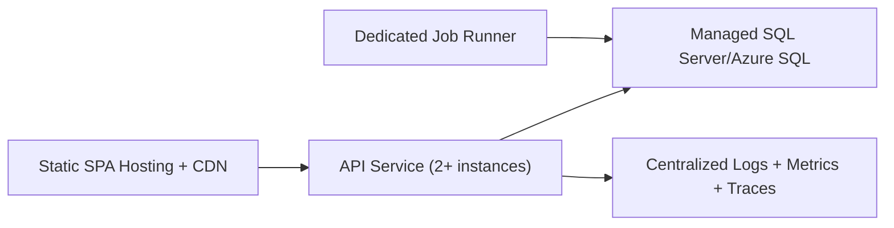

# Digital Health Atlas - Architecture Review Board Document

**Document Version:** 2.0  
**Review Date:** March 9, 2026  
**Author:** Digital Health IT Portfolio Management  
**Classification:** Internal - Architecture Review Board

---

## Table of Contents

1. [Executive Summary](#1-executive-summary)
2. [Review Scope and Method](#2-review-scope-and-method)
3. [Business and Capability Architecture](#3-business-and-capability-architecture)
4. [System Context and Runtime Architecture](#4-system-context-and-runtime-architecture)
5. [Application Architecture](#5-application-architecture)
6. [Data Architecture](#6-data-architecture)
7. [Security and Identity Architecture](#7-security-and-identity-architecture)
8. [API and Integration Architecture](#8-api-and-integration-architecture)
9. [Deployment and Operations Architecture](#9-deployment-and-operations-architecture)
10. [Performance and Scalability](#10-performance-and-scalability)
11. [Reliability and Quality Baseline](#11-reliability-and-quality-baseline)
12. [Holistic Findings and Recommendations](#12-holistic-findings-and-recommendations)
13. [Roadmap Alignment and Next Architecture Steps](#13-roadmap-alignment-and-next-architecture-steps)
14. [Appendix](#14-appendix)

---

## 1. Executive Summary

Digital Health Atlas has evolved from a portfolio tracking tool into an end-to-end platform for:

- intake and triage,
- governance review and voting,
- conversion to execution,
- ongoing delivery and benefit tracking,
- executive reporting and automation,
- multi-organization sharing with controlled access.

### Current architecture posture

- **Business fit:** Strong. Core operational workflows are now integrated across intake, governance, projects, and reporting.
- **Security posture:** Good for current scale. Entra-based authentication and DB-driven RBAC are implemented with route-level enforcement.
- **Data and workflow traceability:** Good. Governance decisions, votes, sharing requests, and audit trails are persisted.
- **Operational maturity:** Moderate. Key gaps remain in production-grade observability, scheduler high availability controls, and API contract governance.

### ARB conclusion

The platform is architecturally sound for current adoption and can support near-term growth. Recommended next focus is operational hardening and architecture governance rather than major rewrites.

---

## 2. Review Scope and Method

This review was completed against the current repository state as of March 9, 2026 and included:

- Frontend architecture and workflow implementations (`src/components/*`, `src/context/*`, `src/utils/*`)
- Backend service and route architecture (`server/index.js`, `server/routes/*`, `server/utils/*`)
- Security and RBAC model (`server/utils/rbacCatalog.js`, auth middleware, seeded permissions)
- Canonical schema and setup strategy (`server/scripts/schema.sql`, `server/scripts/setup_db.js`)
- Existing documentation and implementation plans (`docs/*`)

Review objectives:

1. Confirm current-state architecture accuracy.
2. Identify architectural strengths and material risks.
3. Recommend prioritized architecture actions.

---

## 3. Business and Capability Architecture

### Core business capabilities now implemented

| Capability Domain | Current Implementation Status | Notes |
|---|---|---|
| Strategy and portfolio alignment | Implemented | Goal hierarchy, KPI linkage, goal-to-project relationships |
| Delivery execution | Implemented | Kanban/task management, assignment, checklist subtasks, status reporting |
| Intake workflow | Implemented | Guided 4-stage intake flow with stage readiness and KPI strip |
| Governance workflow | Implemented | Board/member/criteria config, voting, decisions, session mode, queue filters |
| Intake-to-execution handoff | Implemented | Governance-aware conversion with kickoff task blueprints |
| Executive oversight | Implemented | Executive Summary view, risk signals, report export |
| Executive reporting automation | Implemented | Scheduled/manual executive packs, run history, due-run scheduler |
| Multi-organization collaboration | Implemented | Project/goal sharing, request approvals, expiry and attestation |
| Personal productivity | Implemented | My Work Hub with deep links into projects/intake/governance |

### Value stream architecture (target-state in operation)

1. **Request intake** (`Submission`)  
2. **Operational triage** (`Triage`)  
3. **Governance scoring/decision** (`Governance`)  
4. **Conversion/closure** (`Resolution`)  
5. **Execution tracking + benefits realization** (`Projects`)  
6. **Executive monitoring + pack automation** (`Executive Summary` + `Reports`)

---

## 4. System Context and Runtime Architecture

```mermaid
graph TB
    subgraph Client["Client Tier"]
        SPA["React SPA (Vite)"]
    end

    subgraph Identity["Identity Tier"]
        ENTRA["Microsoft Entra ID"]
    end

    subgraph Api["Application Tier"]
        API["Node.js + Express API"]
        SCHED["In-process Executive Pack Scheduler"]
        RBAC["RBAC + Permission Catalog"]
    end

    subgraph Data["Data Tier"]
        SQL["SQL Server"]
    end

    SPA -->|HTTPS + JWT| API
    SPA -->|OIDC / OAuth2 (MSAL)| ENTRA
    API -->|JWKS token validation| ENTRA
    API --> SQL
    SCHED --> SQL
    RBAC --> SQL
```

### Runtime boundaries

- **Presentation tier:** React SPA with module-based feature pages.
- **Application tier:** Express route domains for business workflows.
- **Data tier:** SQL Server with canonical schema-driven setup.
- **Identity tier:** Entra ID for authentication and role claims.

---

## 5. Application Architecture

### 5.1 Frontend architecture

Primary navigation/workspaces:

- My Work
- Executive Summary
- Goals
- Metrics
- Project Dashboard
- Projects
- Reports
- Intake
- Admin

Key architecture characteristics:

- URL/query driven view and stage persistence (`view`, `stage`, admin sub-tabs).
- Shared filtering patterns through reusable UI (`FilterBar` and related controls).
- Context-based global state (`DataContext`, `ThemeContext`, `ToastContext`).
- Route-level lazy loading for heavier modules.
- Governance and intake UX aligned to staged process patterns.

### 5.2 Backend architecture

Backend route domains:

- `dashboard`
- `goals`
- `kpis`
- `projects`
- `tasks`
- `tags`
- `intake`
- `governance`
- `reports`
- `users`
- `admin`

Architecture patterns in use:

- Route-level auth + permission middleware enforcement.
- Parameterized SQL access through `mssql` request bindings.
- Domain-specific utilities for auth, SQL helpers, cache, audit logging.
- In-process scheduler for due executive pack execution.

### 5.3 Authorization convergence

Current implementation uses:

- backend permission checks as source of truth,
- frontend permission helpers for UX gating,
- shared governance helper logic for vote/decision eligibility messaging.

This is materially improved over older dual-check drift patterns, but should be further formalized into a documented effective-permissions contract endpoint.

---

## 6. Data Architecture

### 6.1 Canonical schema status

The canonical schema (`server/scripts/schema.sql`) contains the current feature set and includes **33 tables** across portfolio, governance, intake, reporting, sharing, and admin domains.

### 6.2 Domain-oriented data model

| Domain | Key Tables |
|---|---|
| Portfolio and execution | `Goals`, `KPIs`, `Projects`, `ProjectGoals`, `Tasks`, `TaskChecklistItems`, `StatusReports`, `ProjectBenefitRealization` |
| Taxonomy | `TagGroups`, `Tags`, `TagAliases`, `ProjectTags` |
| Intake and governance | `IntakeForms`, `IntakeSubmissions`, `GovernanceSettings`, `GovernanceBoard`, `GovernanceMembership`, `GovernanceCriteriaVersion`, `GovernanceReview`, `GovernanceReviewParticipant`, `GovernanceVote`, `GovernanceSession`, `WorkflowSlaPolicy` |
| Executive reporting automation | `ExecutiveReportPack`, `ExecutiveReportPackRun` |
| Organizations and sharing | `Organizations`, `ProjectOrgAccess`, `GoalOrgAccess`, `OrgSharingRequest` |
| Identity and access | `Users`, `RolePermissions`, `ProjectWatchers`, `AuditLog` |

### 6.3 Schema and setup strategy

- **Fresh install:** `setup-db:full` applies canonical schema + seeds permissions.
- **Operational model:** schema-first bootstrap only; migrations are not required for environment setup.

### 6.4 Data governance observations

Strengths:

- Relational integrity for core entities.
- Governance and sharing auditability.
- Expiry-aware org-sharing controls.

Gaps to address:

- Formal data retention policy by table (especially `AuditLog`, `StatusReports`, `ExecutiveReportPackRun`).
- Data classification matrix for PII sensitivity boundaries.
- Archival strategy for high-churn operational tables.

---

## 7. Security and Identity Architecture

### 7.1 Authentication

- JWT bearer tokens validated against Entra JWKS.
- Tenant-specific enforcement (`AZURE_TENANT_ID` not `common`).
- Audience and issuer validation are enforced.
- First-login user auto-provisioning into `Users` table.

### 7.2 Authorization

- Permission-driven RBAC with seeded defaults and admin-managed overrides.
- Current seeded business roles:
  - `Viewer`
  - `Editor`
  - `IntakeManager`
  - `IntakeSubmit`
  - `ExecView`
  - `GovernanceMember`
  - `GovernanceChair`
  - `GovernanceAdmin`
- `Admin` role retains full-access behavior.

### 7.3 API hardening controls

- `helmet` security headers
- `cors` origin controls
- global and workflow-specific rate limiters
- parameterized SQL (injection protection)
- centralized error handling patterns

### 7.4 Security findings

- **Strength:** solid baseline for internal enterprise app posture.
- **Gap:** no formalized centralized policy-as-code layer (for example, single effective permission service + machine-readable policy metadata).
- **Gap:** secret rotation and managed identity posture not documented in this artifact.

---

## 8. API and Integration Architecture

### 8.1 API style

- Resource-driven REST with action endpoints where process semantics require them (for example governance start/vote/decide/session actions).
- JSON request/response patterns with route-level authz.

### 8.2 Integration boundaries

- External identity integration: Entra ID only.
- No external event bus or workflow engine currently in runtime.
- Background automation is handled in-process (executive pack scheduler).

### 8.3 API governance findings

- Contract tests exist (`server/tests/contracts`) and are a strong baseline.
- OpenAPI/Swagger contract publishing is not yet present.
- Request/response schema validation appears primarily route-handled rather than centralized schema middleware.

Recommendation: adopt OpenAPI + schema-first validation for critical workflow routes.

---

## 9. Deployment and Operations Architecture

### 9.1 Current operating model

- Frontend: Vite dev server in local environments.
- API: Node.js Express process.
- Database: SQL Server (local Docker in dev, production target typically managed SQL).
- Scheduler: in-process timer started with API process.

### 9.2 Target production reference architecture


```mermaid
graph LR
    FE["Static SPA Hosting + CDN"] --> API["API Service (2+ instances)"]
    API --> SQL["Managed SQL Server/Azure SQL"]
    API --> LOG["Centralized Logs + Metrics + Traces"]
    JOB["Dedicated Job Runner"] --> SQL
```

### 9.3 Operations findings

Primary operational architecture risk is scheduler duplication in multi-instance API deployments. A dedicated single-runner architecture (queue/lock/job service) is recommended.

---

## 10. Performance and Scalability

### Current strengths

- Server-backed pagination for high-volume views (projects/governance queue).
- Indexed relational schema for primary join/filter paths.
- Selective in-memory caching.
- Route-level filtering with scoped queries.

### Scaling risks

- In-memory cache does not scale horizontally.
- Scheduler is process-local and not HA-safe by default.
- Large report/export flows can become memory-intensive under concurrency.

### Recommended performance actions

1. Introduce distributed cache if multi-instance scale is required.
2. Add DB performance telemetry and slow-query reporting.
3. Benchmark executive report generation and governance queue APIs with realistic data volumes.

---

## 11. Reliability and Quality Baseline

### Current baseline

- Frontend linting (`npm run lint`)
- Backend contract tests (`npm run test:contracts`)
- RBAC catalog checks (`npm run lint:rbac`)

### Gaps

- No comprehensive E2E smoke suite across critical business flows.
- No formal SLOs/SLIs documented (availability, p95 latency, workflow completion time).
- Limited documented incident response playbook.

### Recommended quality actions

- Add E2E smoke tests for:
  - intake submit -> governance vote -> decision -> conversion,
  - sharing request lifecycle,
  - executive pack create/run flows.
- Define and publish SLOs for API and workflow processing.

---

## 12. Holistic Findings and Recommendations

### 12.1 Strengths

| Area | Finding |
|---|---|
| Workflow architecture | Intake, governance, and execution are now connected end-to-end |
| Data model | Canonical schema reflects wave2/wave3 capabilities and traceability needs |
| Access model | Entra + DB RBAC with role normalization and seeded defaults is mature |
| UX architecture | Staged workflow patterns and filter consistency improved usability |
| Multi-org control | Sharing requests + expiry + attestation strengthen governance |

### 12.2 Priority recommendations

| Priority | Recommendation | Why it matters |
|---|---|---|
| P1 | Externalize scheduler coordination (single-run guarantee) | Prevent duplicate executive pack runs in scaled API deployments |
| P1 | Publish OpenAPI contracts + schema validation middleware | Reduce drift, improve integration confidence, support contract governance |
| P1 | Add centralized observability (structured logs, trace IDs, metrics dashboards) | Required for production troubleshooting and ARB auditability |
| P1 | Add E2E smoke automation for core cross-domain flows | Protect release quality across intake-governance-project lifecycle |
| P2 | Define data retention/classification policies by table | Required for compliance, storage management, and legal defensibility |
| P2 | Formalize effective-permission API contract | Further reduce UI/API authorization drift risk |
| P3 | Evaluate event-driven integration for notifications and downstream consumers | Improves extensibility as ecosystem integration needs grow |

---

## 13. Roadmap Alignment and Next Architecture Steps

### Implemented capability waves (current state)

- **Wave 1:** My Work Hub, intake-to-execution blueprint, permission convergence improvements, URL/state routing, baseline contract testing.
- **Wave 2:** SLA aging policy, governance session mode, executive pack automation, sharing request workflow with expiry.
- **Wave 3:** Capacity-aware governance inputs, intake effort estimates, benefits realization loop, executive pack org scoping, predictive risk surfaces.

### Recommended next architecture wave

1. Production observability platform and SLOs.
2. Scheduler and background processing architecture hardening.
3. API governance modernization (OpenAPI + validation + versioning policy).
4. Data lifecycle governance (retention, archival, data classification).

---

## 14. Appendix

### A. Key scripts and operational commands

```bash
# Fresh setup
cd server
npm run setup-db:full

# Contract tests
npm run test:contracts

# RBAC catalog consistency
npm run lint:rbac
```

### B. Reviewed key artifacts

- `server/index.js`
- `server/routes/*.js`
- `server/utils/rbacCatalog.js`
- `server/scripts/schema.sql`
- `server/scripts/setup_db.js`
- `src/components/*`
- `src/context/DataContext.jsx`

---

*End of ARB Architecture Review (Current State, March 2026)*
